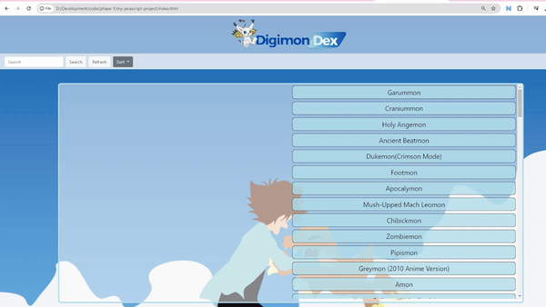

# Digimon Dex Web application

Welcome to my first Vanilla Javascript Project!
It uses HTML, CSS & JS to create a Single Page Application.

## Description

This is a Digimon Dex that will display the first 300 Digimon Infos sourced from an external free public API

## How to Navigate the Web App

👾 The page includes a scrollable list of 300 Digimons displayed on the right side of the page  

👾 Hovering over a digimon name would automatically display the respective Digimon Data on the left of the page  

👾 To search a particular name of a Digimon, use the search bar on top left of the page and click the "Search" button and this would display the Digimon name/names on the right  

👾 Click the "Refresh" button to bring up the all the list of Digimons again  

👾 The "Sort" button includes sorting the list in ascending or descending order  

## Credits:

Free Digimon API provided by: https://digi-api.com/

Data extracted from endpoint: https://digi-api.com/api/v1/digimon?pageSize=300

Please note: DAPI is an free Digimon API, it uses data from official and fan based sources (mainly Wikimon.net). DAPI is not affiliated with nor claims ownership to material produced by Bandai.

Background image is sourced from https://www.deviantart.com/greenmapple17/art/Digimon-Adventure-Tri-Minimalist-Wallpaper-533783505

## A Quick GIF Demo of Digimon Dex!

## License

This project is licensed under the MIT License.

## Contribution Guidelines

If you would like to contribute to the project development:

1. Fork the repository.
2. Create a new branch for your feature or bug fix.
3. Make your changes and submit a pull request.

Feel free to adjust any details or formatting to better suit your project and preferences.

## Contact

For any inquiries or feedback, please contact codewithemilychew@gmail.com.
